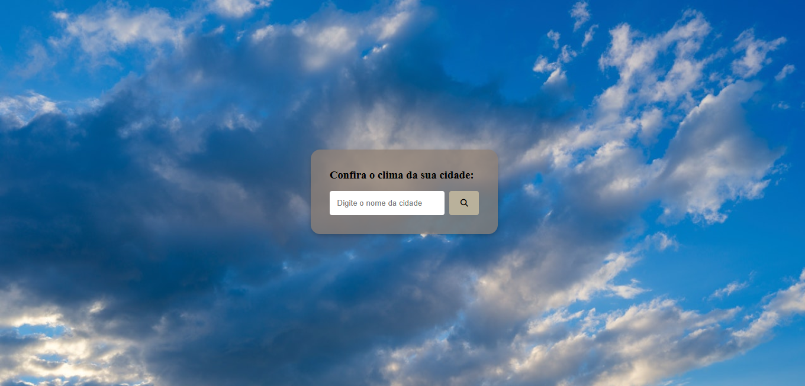
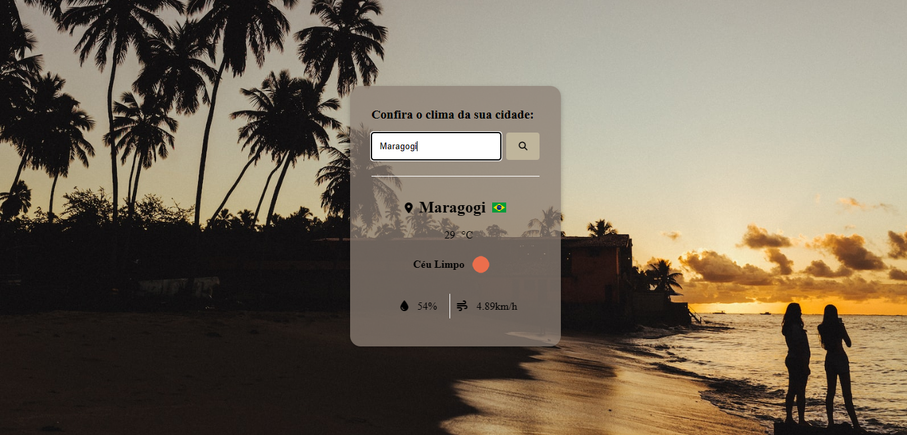
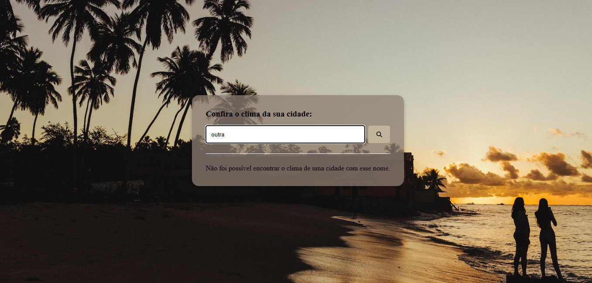
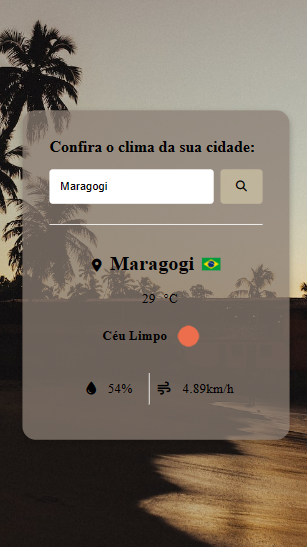

# API Clima

Após informação de cidade:

Caso usuário digite algo errado. Exemplo: (siglas (sp), erro de digitação ou outras coisas).

## Sobre o Projeto:

O projeto consiste em exibir o clima das cidades mostrando a bandeira a do País, temperatura, umidade do ar e velocidade do vento da cidade desejada.

## Aprendizado adquerido:

Com esse projeto pude aprender mais sobre consumo de api, nele utilizei três apis: Open weather para os dados de clima de acordo com a localização informada, Country flags para obter as bandeiras dos países e Unsplash para a modificação do background com imagens relacionadas a cidade mencionada.

## Imagem do projeto na versão Mobile:

## Planejamento do projeto

- [x] Criar chave key no openWeatherAPI
- [x] Criar container de pesquisa
- [x] Variaveis css
- [x] Estilizar container
- [x] Estilizar formulário
- [x] Criar funções
- [x] Adicionar evento ao botão de pesquisa
- [x] Ativar classe hide
- [x] Tratamento de erro
- [x] Interação no background

## Instruções de uso:

Para que possa baixar esse projeto, será necessário:
* Fazer clone do projeto, no botão verde escrito <>Code.
* Selecionar a opção Download ZIP 
* Ter instalado na máquina um editor de código, no meu caso utilizo Visual Studio Code.

## Ferramentas utilizadas:

### Autora: 

  https://github.com/ThMenezes

